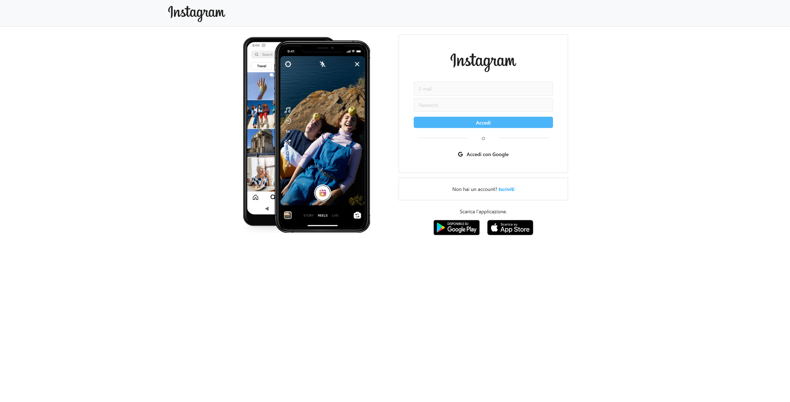

# Instagram - React

    
    

    
    

## Descrizione
Questo progetto rappresenta il front-end di una web-app che emula la celebre piattaforma Instagram.
É stato realizzato con l'intento di mettere in pratica e approfondire le tecnologie apprese di recente, e si interfaccia con un back-end per essere funzionale.

## Funzionalità
- **Autenticazione flessibile**: Registrati tradizionalmente o utilizza Google oAuth 2.0 per un accesso rapido.

- **Registrazione intuitiva**: Inserisci la tua mail, crea una password sicura, scegli uno username unico, e completa il tuo profilo con nome e immagine per iniziare a connetterti con gli altri!

- **Pubblica un post**: Seleziona un’immagine, scrivi una descrizione e aggiungi il luogo per condividere i tuoi momenti preferiti. Ogni post include automaticamente la data di pubblicazione, visibile nell’interfaccia utente.

- **Esplora con facilità**: Scopri i post di tutti gli utenti nella homepage, oppure clicca su un utente o cercalo tramite la barra di ricerca per visitare il suo profilo personale.

- **Personalizzazione del profilo**: Modifica i tuoi dati, aggiungi una bio e gestisci il tuo account con facilità.

- **Controllo completo del contenuto**: Puoi eliminare i post che non desideri più condividere o cancellare l'account.

- **Architettura scalabile**: Utilizzo dei Context di React per una gestione efficiente dello stato globale.

- **Validazioni complete**: Per garantire la sicurezza e la correttezza dei dati inseriti dall'utente.

- **Work in progress**: Funzionalità come profili privati, like ai post e follow saranno aggiunte prossimamente!

## Tecnologie utilizzate
- **React**: Per costruire un'interfaccia utente dinamica e reattiva.
- **SCSS & Bootstrap**: Per uno styling personalizzato e responsivo con accesso a componenti predefiniti.

## Librerie e metodi utilizzati
- `useState`, `useEffect`: Per gestire lo stato e il ciclo di vita dei componenti.
- `useNavigate`: Per navigare tra le pagine.
- `formik`, `yup`: Per la gestione dei form e la validazione.
- `React Router` con `Link`: Per il routing all'interno dell'app.
- `moment`: Per manipolare e visualizzare date e orari.
- `useRef`, `useParams`: Per accedere a riferimenti DOM e parametri URL.

## Installazione e avvio Locale
1. Clona il repository sul tuo computer locale.
2. Naviga nella directory del progetto.
3. Installa le dipendenze con il comando `npm install`.
4. Avvia l'applicazione con il comando `npm start`.

## Come utilizzare
- Apri il tuo browser e vai all'indirizzo `localhost:3000` per utilizzare l'applicazione.
- Registra un account o accedi, poi inizia a esplorare i profili e i post degli altri utenti e a pubblicare i tuoi.

## Attenzione
Per una completa funzionalità di questa web-app, è necessario configurare il back-end. Assicurati di visitare e configurare l'altro progetto, disponibile qui: https://github.com/vito-pizzulli/express-instagram.

## Progetto didattico
Questa replica di Instagram è stata creata esclusivamente a scopo di apprendimento e sperimentazione tecnologica. Non è un prodotto commerciale, né intende violare i diritti di marchio di Instagram.